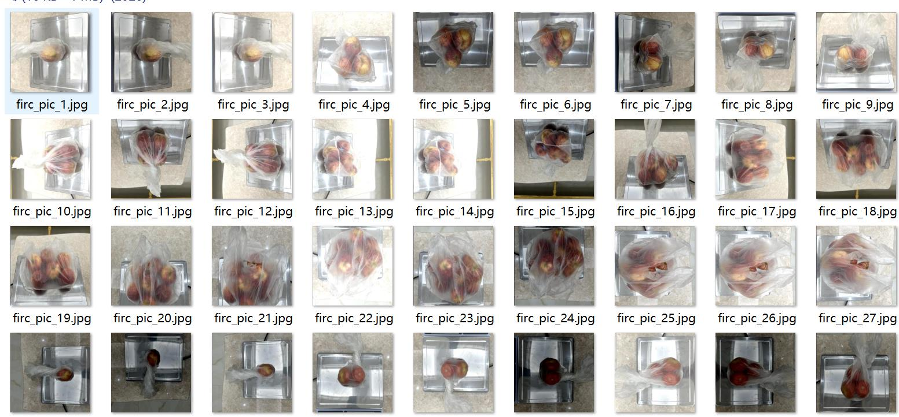
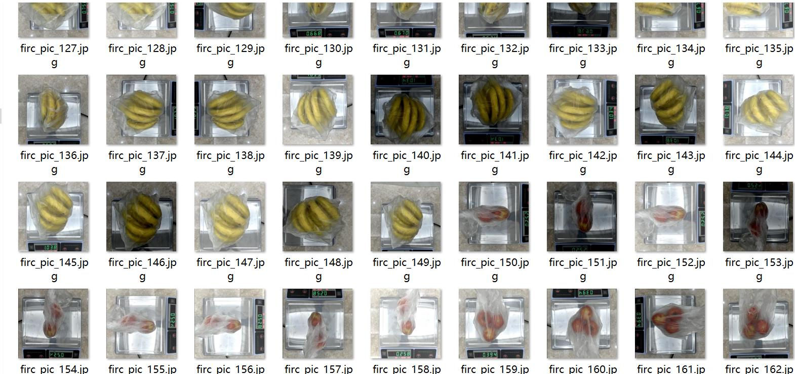
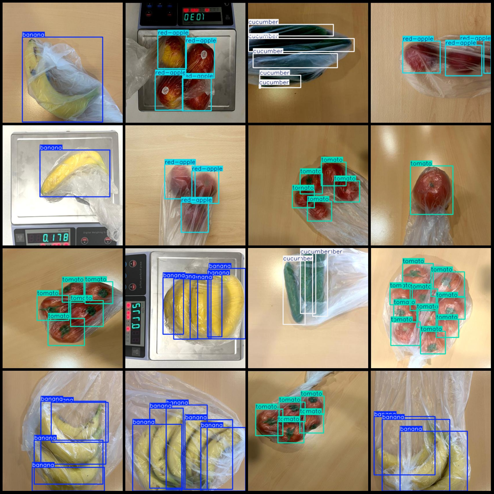
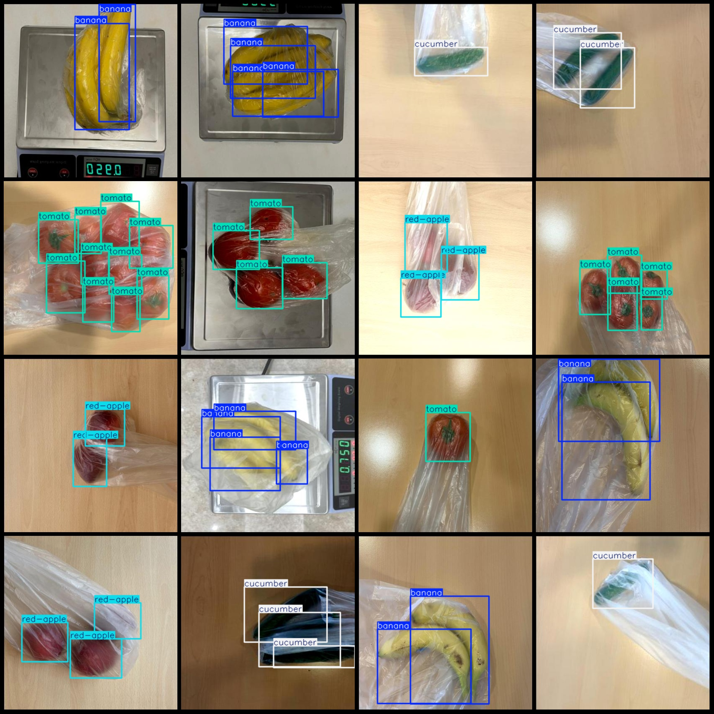

# Shopping Mall Scales Fruit Apple Banana Tomato Cucumber Detection Dataset VOC+YOLO format 2836 images in 4 categories

```
The dataset consists of 2836 images of apples, bananas, tomatoes, and cucumbers labeled with their categories in the VOC+YOLO format.

Dataset format: Pascal VOC format + YOLO format (txt files without split paths, only containing jpg images and corresponding VOC format xml files and yolo format txt files)
Number of images (jpg file count): 2836
Number of annotations (xml file count): 2836
Number of annotations (txt file count): 2836
Number of annotation categories: 4
Annotation category names (note that the order of categories in the yolo format does not correspond to this, but rather based on the labels folder classes.txt): ["banana", "cucumber", "red-apple", 
"tomato"]
Number of bounding box instances per category:
banana = 2173
cucumber = 3102
red-apple = 2071
tomato = 3938
Total bounding boxes: 11284
Number of images per category:
banana = 665
cucumber = 844
red-apple = 582
tomato = 745
Image resolution: 416x416
Annotation tool used: labelImg
Annotation rules: draw bounding boxes for each category
Important note: The dataset does not have been divided into training, validation, or test sets; users are required to do so themselves.
Special declaration: This dataset does not guarantee the accuracy of the trained models or weight files.
Image preview:
Annotation example:
```
## Images






Here is a pay link on Stripe ( https://buy.stripe.com/3cs8yP7sY87d0vu9AB ). Please contact me lonlonago@foxmail.com after funding $89, and I will send you a complete data files , thank you!


